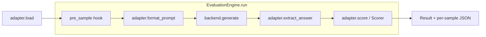
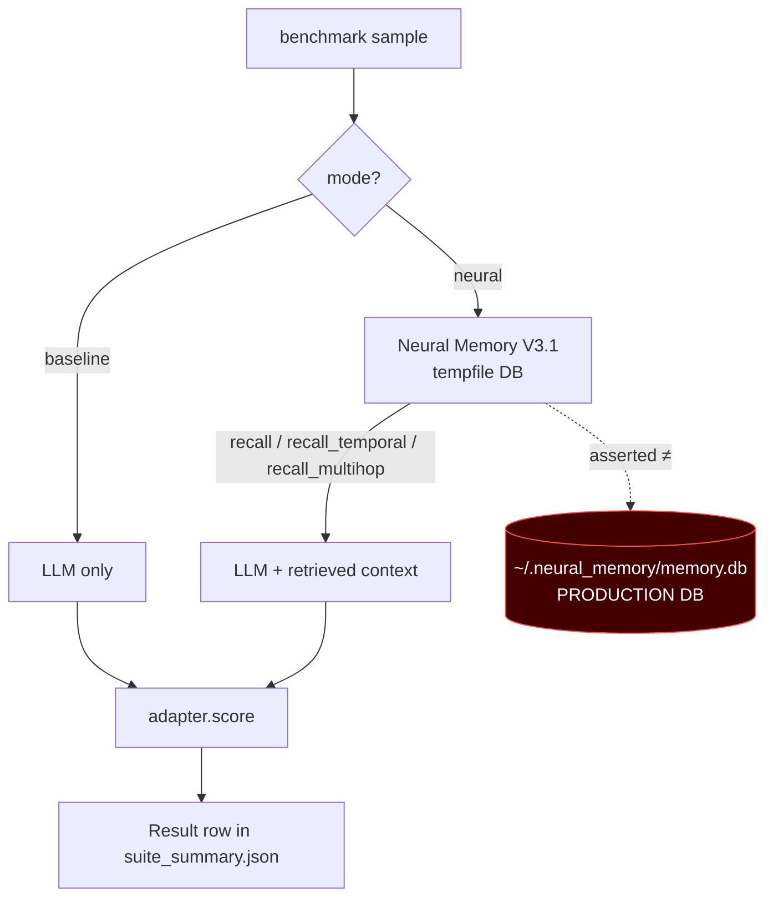
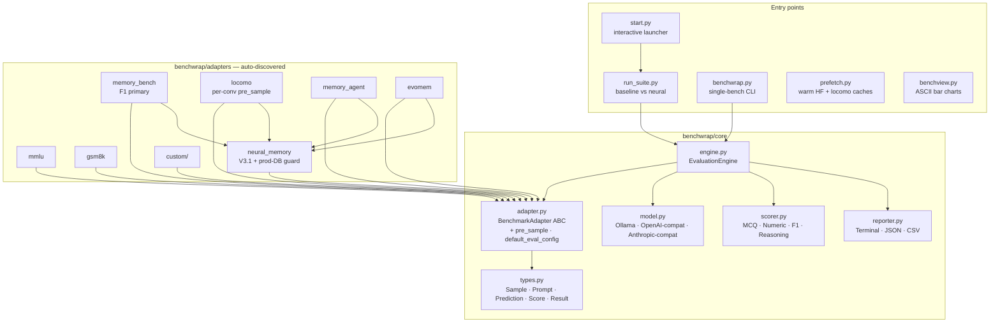

# benchwrap

ONE adapter to rule them all.

A unified LLM benchmark wrapper where ANY benchmark plugs in. Zero cheating. Full transparency. Production-faithful memory eval.

## The Problem

We've run 5+ benchmark frameworks. Each one: different config format, different model connection, different scoring, different result format, different bugs. Worse — some have baked-in assumptions that make honest evaluation hard. Substring "contains" scoring inflated 50%-real to 90%-claimed. Reasoning models burned token budgets in `<thinking>` blocks and scored 0 because we read the wrong field. Memory benchmarks ran with `auto_connect=False` to dodge slow ingest, then reported numbers that wouldn't survive deployment.

## The Solution

**ONE wrapper. ONE interface. ANY benchmark plugs in. ZERO cheating. PRODUCTION-FAITHFUL.**

### Principles

1. **TRANSPARENT** — every prompt logged, every scoring decision visible. No black-box templates.
2. **HONEST** — no pre-injected answers, no weight manipulation, no "adjusted" scores. SQuAD-style F1 is the canonical metric for free-form QA. No `contains` substring shortcuts.
3. **PLUGGABLE** — any benchmark is an adapter: 5 methods + optional `pre_sample` hook. That's the entire contract.
4. **MODEL-AGNOSTIC** — Ollama, OpenAI, NIM, MiniMax, Anthropic, vLLM, custom. All through one interface.
5. **PRODUCTION-FAITHFUL** — memory benchmarks run with the same settings the production agent uses (`auto_connect=True`, `detect_conflicts=True`, hybrid retrieval, rerank). No "benchmark-safe" relaxations that mask real-world behavior.
6. **PROD DB IS OFF-LIMITS** — `db_path` is required, asserted not-prod at construction; benchmark runs always use a tempfile.

### How a sample flows



Every step is logged. `Prompt.raw_text` is the exact text the model sees. `Score.scoring_method` records how the verdict was reached. Nothing is hidden.

## Quick Start

```bash
# Interactive launcher (asks model + preset, confirms)
python3 start.py

# Direct: run V3.1 production-faithful suite
python3 run_suite.py --model ollama:gpt-oss:120b-cloud --modes baseline,neural --limit 25

# Full coverage (every sub-task, every sample — hours)
python3 run_suite.py --full --model ollama:gpt-oss:120b-cloud

# Single benchmark via the CLI
python3 benchwrap.py run mmlu --model ollama:openhermes:7b-v2.5 --limit 50
python3 benchwrap.py run gsm8k --model ollama:qwen2.5:7b --limit 100

# Warm caches (HF datasets, locomo, etc.) before benchmarks
python3 prefetch.py
```

## The Suite (`run_suite.py`)

Two modes — same prompts, same scorer, only the memory layer changes:



| Mode | What it tests |
|------|---|
| `baseline` | LLM only, no memory. Confabulation floor for memory tasks. |
| `neural`   | LLM + V3.1 Neural Memory with the full toolset (`remember`, `recall`, `recall_temporal`, `recall_multihop`, `think`, `connections`, `graph`). Each memory adapter dispatches to the right tool per task type. |

**No `prod-readonly` mode.** The suite never reads or writes the production memory DB. Each `neural` run creates a tempfile DB under `/tmp/benchwrap_nm_<rand>/memory.db` and the backend asserts at construction that the path is not `~/.neural_memory/memory.db`.

### Honest scoring

| Adapter | Primary metric | Why |
|---|---|---|
| MMLU | letter accuracy (A–D) | Hendrycks et al. canonical |
| GSM8K | numeric EM (final answer) | Wei et al. canonical |
| memory-bench | **token F1** | SQuAD/MemAgent canonical for free-form QA — not `contains` substring (was bench-maxxing) |
| LoCoMo | **token F1** with Porter stemming | LoCoMo paper canonical — not the binary `F1>0.5` threshold |

EM is reported alongside F1 for every adapter. Both are auditable in `results/suite/{mode}/*.json`.

## Verified results — gpt-oss:120b-cloud via Ollama, V3.1 Neural Memory, limit=5

```
benchmark/dataset                       baseline    neural    n
─────────────────────────────────────────────────────────────────
mmlu/STEM                                100.0%    100.0%     5
gsm8k/main                                80.0%    100.0%     5     (memory neutral; non-determinism)
memory-bench/recall-accuracy               1.1%     94.3%     5     (+93.2 pp F1)
memory-bench/temporal-ordering             0.0%     41.7%     4     (+41.7 pp via recall_temporal)
memory-bench/multi-hop                     1.3%     88.9%     3     (+87.6 pp via recall_multihop graph)
locomo/single-hop                         18.7%      5.9%     5     (regression — see notes)
memory-agent-bench/conflict-sh-6k          0.0%      0.0%     5     (model trusts training over memory; benchmark working as designed)
```

Strict F1 (no contains shortcut), `auto_connect=True`, `detect_conflicts=True`, hybrid retrieval, cross-encoder rerank, `think:false` on the LLM side.

## Model Backends

| Spec | Resolves to | Auth |
|------|-------------|------|
| `ollama:MODEL` | Ollama `/api/chat` (native, with `think:false`) | none |
| `ollama:MODEL@HOST` | custom Ollama host | none |
| `nim:MODEL` | NVIDIA NIM `/v1` | `NIM_API_KEY` |
| `openai:MODEL` | OpenAI `/v1` | `OPENAI_API_KEY` |
| `minimax:MODEL` | MiniMax `/anthropic/v1/messages` | `MINIMAX_API_KEY` |
| `minimax-cn:MODEL` | MiniMax CN `/anthropic/v1/messages` | `MINIMAX_CN_API_KEY` |
| `anthropic:MODEL` | Anthropic `/v1/messages` | `ANTHROPIC_API_KEY` |
| `api:MODEL@URL[#KEY]` | any OpenAI-compatible | inline or env |

`run_suite.load_env()` reads tokens from `~/.hermes/.env` automatically.

**Reasoning models** (`gpt-oss:120b`, `qwen3`, `deepseek-r1`, MiniMax-M2.7, Claude 4.x): thinking is **strict-disabled** by default — `think:false` on Ollama, `thinking: {type: "disabled"}` on Anthropic-compat. Benchmarks need surfaced answers, not invisible CoT that burns the budget and leaves `content` empty.

## Built-in Adapters

| Adapter | Dataset(s) | Scoring | Memory tool dispatch |
|---------|-----------|---------|----------------------|
| **mmlu** | 57 subjects + 4 categories | letter A–D, 5-shot canonical | n/a |
| **gsm8k** | main, socratic | numeric, 8-shot CoT canonical | n/a |
| **memory-bench** | recall-accuracy, temporal-ordering, multi-hop | F1 (primary) + EM | `recall` / `recall_temporal` / `recall_multihop` per dataset |
| **locomo** | 10 conversations × 5 categories | F1 with Porter stemming | per-conversation isolation via `pre_sample` hook |
| **memory-agent-bench** | 12 sub-tasks (conflict, retrieval, ICL, …) | F1 + EM | `recall` |
| **evomem** | mmlu-pro, gpqa-diamond, aime-2024 | dataset-specific | `recall` |

## Production-faithful Neural Memory

`benchwrap/adapters/neural_memory.py` wraps the V3.1 stack:

```python
NeuralMemoryBackend(
    db_path=...,                  # REQUIRED, asserted != PROD_DB_PATH
    retrieval_mode="hybrid",      # semantic + BM25 + entity + temporal + PPR + salience, RRF-fused
    rerank=True,                  # cross-encoder ms-marco-MiniLM rerank
    temporal_weight=0.2,          # production default
)

# store: auto_connect=True, detect_conflicts=True (production behavior)
backend.store(content, label, metadata)

# All 6 V3.1 tools exposed:
backend.recall(q, top_k=5)
backend.recall_temporal(q, top_k=5, temporal_weight=0.5)
backend.recall_multihop(q, top_k=5, hops=2)
backend.think(start_id, depth=3)
backend.connections(mem_id)
backend.graph()
```

V3.1's 0.45 connection threshold (was 0.15 in V3) means `auto_connect=True` is fast even at LoCoMo's 2000-turn scale. No more "benchmark-safe" auto_connect=False hack.

## Custom Adapters

Drop a `.py` file in `benchwrap/adapters/custom/` (or `benchwrap/adapters/`). Implement the 5-method contract; `pre_sample` is optional for per-sample state setup.

```python
from benchwrap.core.adapter import BenchmarkAdapter
from benchwrap.core.types import Sample, Prompt, Score

class MyBenchmark(BenchmarkAdapter):
    def name(self):     return "my-benchmark"
    def datasets(self): return ["default"]

    def load(self, dataset="default", split="test", limit=None):
        yield Sample(id="q1", input="What is 2+2?", reference="4")

    def format_prompt(self, sample, fewshot=None):
        text = f"Q: {sample.input}\nA:"
        return Prompt(system=None,
                      messages=[{"role": "user", "content": text}],
                      raw_text=text)

    def score(self, prediction, reference, sample):
        em = 1.0 if prediction.strip() == reference.strip() else 0.0
        return Score(exact_match=em, accuracy=em,
                     raw_prediction=prediction, raw_reference=reference)

    # Optional: declare canonical eval protocol (fewshot, temperature, …)
    def default_eval_config(self):
        return {"fewshot": 5}

    # Optional: per-sample state setup (e.g. swap memory state per conversation)
    def pre_sample(self, sample, backend=None):
        ...
```

Auto-discovered on next `benchwrap list`.

## Architecture

### Component map



### File layout

```
benchwrap/
├── benchwrap.py           # CLI entry point
├── run_suite.py           # 2-mode suite runner (baseline vs neural)
├── start.py               # interactive launcher
├── prefetch.py            # warm HF datasets + locomo + MAB caches
├── benchview.py           # ASCII-bar visualization of saved JSONs
├── benchwrap/
│   ├── core/
│   │   ├── types.py       # Sample, Prompt, Prediction, Score, Result
│   │   ├── adapter.py     # BenchmarkAdapter ABC + pre_sample/default_eval_config hooks
│   │   ├── model.py       # ModelBackend ABC + Ollama, OpenAI, Anthropic-compat backends
│   │   ├── scorer.py      # MCQ, Numeric, F1, Reasoning scorers
│   │   ├── engine.py      # EvaluationEngine — calls pre_sample, merges adapter eval defaults
│   │   └── reporter.py    # Terminal/JSON/CSV output
│   └── adapters/
│       ├── mmlu.py
│       ├── gsm8k.py
│       ├── memory_bench.py     # F1-primary, no contains shortcut
│       ├── locomo.py           # per-conversation isolation via pre_sample
│       ├── memory_agent.py
│       ├── evomem.py
│       ├── neural_memory.py    # V3.1 wrapper, hard prod-DB protection
│       └── custom/             # drop your adapters here
└── results/                    # default output dir
```

## What we DON'T do

- Pre-inject answers into prompts
- Weight scores to "normalize" across benchmarks
- Use `contains` substring as a primary metric (gives free credit for buried-correct-in-noise predictions)
- Use a binary `F1>0.5` threshold instead of raw F1 (obscures real numbers)
- Disable `auto_connect`/`detect_conflicts` to make benchmarks easier (production wouldn't)
- Touch `~/.neural_memory/memory.db` — physically asserted not-prod at backend construction
- Hide any part of the evaluation pipeline

## Lessons (the hard way)

1. **AIME first-char scoring** — wrong for integer answers → dataset-aware extractor
2. **MAB force-flag** — loaded old results without clearing → force = skip load_existing
3. **EvoMem broken imports** — AgentType/DatasetType missing → standalone only
4. **NIM rate limiting** — 0.01 it/s → Ollama for benchmarks
5. **Hardcoded paths** — break on other machines → `Path.home()` everywhere
6. **Reasoning models** — empty content via OpenAI-compat → native Ollama API + `think:false` + Anthropic `thinking: {type: "disabled"}`
7. **GSM8K extractor** — first `=` regex grabbed mid-CoT equation → walk markers in priority order, prefer LAST match (`####` > `\boxed` > `Answer:` > last number)
8. **Bench-maxxed scoring** — `contains` substring let "answer buried in 500 words of hallucination" score 1.0 → SQuAD-style F1 primary
9. **LoCoMo cross-conversation contamination** — bulk-ingesting all 10 confs into one DB had Caroline's questions recall Calvin's dialog → per-conversation `pre_sample` clear+ingest
10. **auto_connect O(N²) on large ingests** — V3.1's 0.45 threshold (was 0.15) keeps it sparse and fast → enabled by default

## License

MIT
